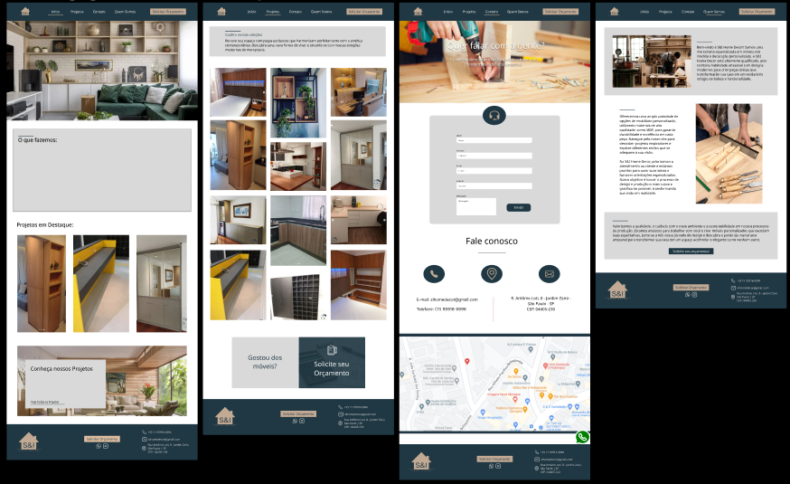
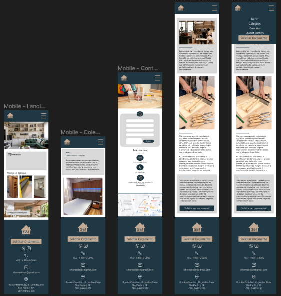

# SI HOME DECOR
Este repositório contém o código-fonte e os recursos necessários para o desenvolvimento do website da empresa de marcenaria Si Home Decor. O website foi projetado para promover os serviços e produtos oferecidos pela empresa, além de fornecer informações relevantes aos clientes.

# Protótipo de Site de Marcenaria - Figma

O protótipo do SI HOME DECOR é um projeto desenvolvido no Figma que visa criar uma experiência de navegação interativa para um site de marcenaria. Este protótipo foi criado com o objetivo de ser compartilhado no GitHub, permitindo que outros colaboradores visualizem e interajam com o design proposto.

Visão Geral do Protótipo:
O SI HOME DECOR é um site de marcenaria que oferece serviços personalizados de móveis e decoração para clientes residenciais e comerciais. O protótipo inclui uma variedade de telas que demonstram diferentes seções e recursos do site, proporcionando aos usuários uma visão completa da proposta de design.

**Principais Características:**

**Página Inicial:** A página inicial apresenta uma introdução atraente com imagens de projetos concluídos e destaca os principais serviços oferecidos pela marcenaria.

**Coleções:** Nesta seção, os usuários podem explorar uma seleção de projetos anteriores, com imagens e detalhes dos materiais utilizados. 

**Sobre Nós:** Nesta seção, é apresentada a história e os valores da empresa, bem como a equipe de profissionais envolvida nos projetos. Também são destacadas as certificações e parcerias relevantes da marcenaria.

**Contato:** Uma página de contato com um formulário para os visitantes enviarem suas dúvidas, solicitações de orçamento ou marcarem uma consulta. Além disso, são fornecidos os detalhes de contato da empresa, como telefone, e-mail e endereço físico.

**Interatividade do Protótipo:**
O protótipo foi criado no Figma com interações e animações para simular a experiência de navegação pelo site. Os usuários podem clicar em botões, navegar pelos menus e visualizar transições suaves entre as telas, proporcionando uma experiência mais próxima de um site real.

**Como Acessar o Protótipo:**
Para visualizar o protótipo do SI HOME DECOR, acesse o link a seguir: https://www.figma.com/file/4ONhW3pG74R56wXd23ivUB/Design-Si-Home-Decor?type=design&mode=design&t=9D1Js6v7lLGqU6Lu-1

**Protótipo versão web:**
!

**Protótipo versão mobile:**

**Observações Finais:**
Este protótipo tem como objetivo fornecer uma visão clara e interativa do design proposto para o site da marcenaria SI HOME DECOR. 

